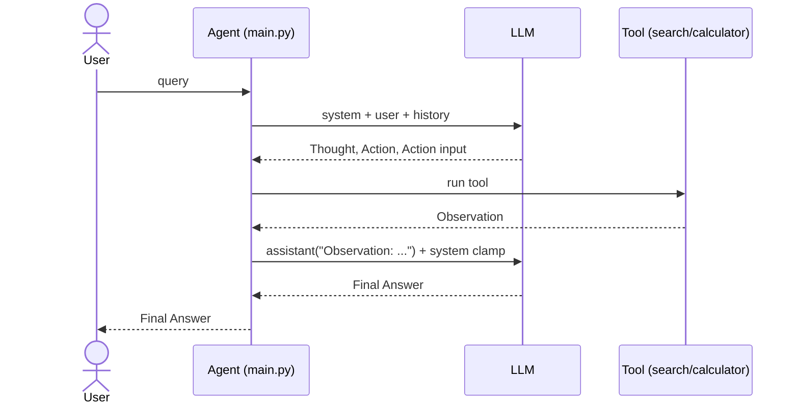

# react_agent: Minimal ReAct Agent (Search + Calculator) with Deterministic Control

A minimal, production-oriented ReAct agent in Python for tool-augmented question answering. It implements a deterministic controller, audit-grade logging, and clear extension points suitable for client work and rapid prototyping.

## At a glance

- Python 3.10+
- Tools: `search` (DuckDuckGo via `ddgs`), `calculator` (safe AST)
- Deterministic controller with turn cap, one-search-per-run, and finalize clamp
- Structured logs in `report_log.txt`
- CI: GitHub Actions (ruff lint + byte-compile)

---

## Features

- Thought/Action/Action input/Observation/Final Answer schema with strict parsing in `parse_response()`
- Tools:
  - `search(query)` using DuckDuckGo via `ddgs` (aggregates compact observations)
  - `calculator(expr)` with safe AST evaluation
- Deterministic controller (in `main()`):
  - While-loop with `max_turns`
  - One-search-per-run policy (prevents thrashing)
  - Observation-only assistant messages after tool calls (no duplicate schema keys)
  - One-time “finalize now” clamp after tool calls to prevent extra actions
  - Quote-unwrapping in parsing so `''` never counts as a real answer
- Rich logging to `report_log.txt` for deep inspection; minimal console output

---

## Example interactions

Run with Python 3.10+.

```bash
$ python main.py "What is the population of Germany?"

======================================== Turn 1 ========================================
Thought: I should use the search tool to retrieve Germany's population.
Action: search
Has Final Answer: No
Tool: search | Done

======================================== Turn 2 ========================================
Thought: I see that I was provided the detailed information about Germany, but the answer to the question was asked: "What is the population of Ge...
Action: 
Has Final Answer: Yes

======================================== Final Answer ========================================
83,577,140
```

```bash
$ python main.py "What is 25*49/2?"

======================================== Turn 1 ========================================
Thought: I should calculate 25*49/2 using the calculator.
Action: calculator
Has Final Answer: No
Tool: calculator | Done

======================================== Turn 2 ========================================
Thought: The observation, 612.5, is the result of the calculation.
Action:
Has Final Answer: Yes

======================================== Final Answer ========================================
612.5
```

---

## How it works

Key components in `main.py`:

- `search(query: str) -> str`
  - Calls DuckDuckGo via `ddgs` and builds a compact, structured Observation combining titles, snippets, and URLs.
- `calculator(expr: str) -> str`
  - Evaluates basic arithmetic securely via a restricted AST evaluator.
- `parse_response(resp: str) -> dict`
  - Parses the model’s 5-key schema block;
  - Keeps only the first non-empty value per key;
  - Unwraps `''`, `""`, and `````` to normalize empties.
- `chat(messages: List[Dict]) -> str`
  - Simple LLM call with basic retry/backoff; logs payload sizes.
- `main()`
  - Seeds `system` + `user`, then loops until `Final Answer` or `max_turns`.
  - Appends the assistant’s schema message each turn to preserve state.
  - On tool call, appends an assistant `Observation: ...` message only (clean context for the next turn).
  - Adds a one-time system clamp after tool calls
  - Restricts `search` dispatch to once; additional attempts get nudged to finalize.

### Sequence



---

## Setup

- Python 3.10+ recommended.
- Create and activate a virtual environment.
- Install dependencies:

```bash
pip install -r requirements.txt
```

- Copy environment and set secrets:

```bash
cp .env.example .env
# edit .env with your values
```

Environment variables used in `.env`:

- `GROQ_API_KEY`: your Groq API key
- `MODEL_ID`: Groq model ID (for example, llama3-8b-8192 or similar)
- `SYSTEM_PROMPT`: the ReAct schema + guardrails (a sample is in `.env.example`)
- `DEFAULT_SEARCH_RESULT`: optional default when a search returns no results

---

## Usage

```bash
python main.py "What is the population of Germany?"
python main.py "What is 25*49/2?"
```

Console shows a concise narrative; `report_log.txt` captures full details with structured markers.

---

## Design highlights

- **Deterministic orchestration** — controller enforces turn limits, prevents tool thrashing, and drives finalization.
- **Resilient parsing and guardrails** — strict schema, quote-unwrapping, and Observation-only injection reduce failure modes.
- **Operational visibility** — structured logging (console + `report_log.txt`) supports traceability and debugging.
- **Extensibility** — tools and policies are decoupled; adding retrieval or summarization tools requires minimal changes.

---

## Extending the demo

- Swap DuckDuckGo for another search provider (Brave/Bing/GSerp) behind the same `search()` interface.
- Add new tools (e.g., web page fetcher + summarizer) and gate them via controller policy.
- Add unit tests for parsing and controller transitions.
- Add a fallback answer synthesizer on the last turn (e.g., regex extract key facts from Observation).

---

## Repository Structure

```
react_agent/
├─ main.py              # Core agent, tools, controller, logging
├─ .env.example         # Sample SYSTEM_PROMPT + config
├─ .env                 # Your secrets/config (ignored)
├─ requirements.txt     # Runtime deps
├─ report_log.txt       # Run logs (ignored)
└─ README.md            # This document
```
---

## Use cases

- Rapid POCs for retrieval-augmented Q&A where a deterministic controller is preferred.
- Lightweight data/knowledge lookups combining search with rule-based finalization.
- Analytic helpers mixing tool calls (e.g., web search) with safe, local computations.

---

## Tech stack

- Python 3.10+
- Groq Chat Completions API (`groq`)
- Environment management via `python-dotenv`
- Search via DuckDuckGo (`ddgs`)

---

## License

MIT License — see `LICENSE` for details.
